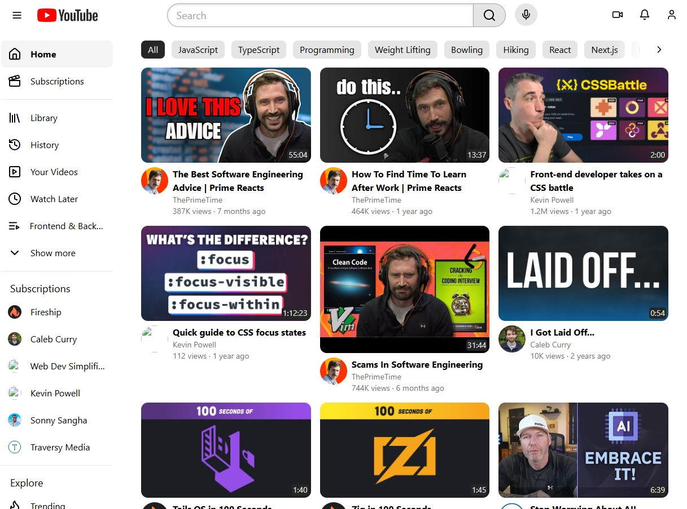

## Hi there 👋

## My name is Josué but you can call me `Josh`

As a software developer, I thrive on turning ideas into functional and beautiful applications. My journey in the tech world has been exciting—I’ve dabbled in various languages and frameworks, but React holds a special place in my heart. 🚀 When I’m not coding, you’ll find me exploring new technologies, reading tech blogs, or sipping coffee while sketching wireframes. Let’s connect and build something awesome together! 🌟

### My skills

  
  
  
  
  
  
  
  

### Most used languages

  

## React projects

#### [YouTube Home Page Replica](https://github.com/JosueDeLosSantos/youtube-home-page-react-ts-tailwind.git)

  

#### [Ableton Website Home Page](https://github.com/JosueDeLosSantos/Ableton-Website-Recreation.git)

#### [Personal Blog CMS](https://github.com/JosueDeLosSantos/blog-api-admin-page.git)

  &nbsp;&nbsp;&nbsp;
  

  &nbsp;&nbsp;&nbsp;
  

  

#### [Memory Game](https://github.com/JosueDeLosSantos/Memory-Card.git)

#### [CV Builder](https://github.com/JosueDeLosSantos/CV-builder.git)

<a styles="display: flex;" href="https://github.com/JosueDeLosSantos/CV-builder.git">&nbsp;&nbsp;&nbsp;</a>
